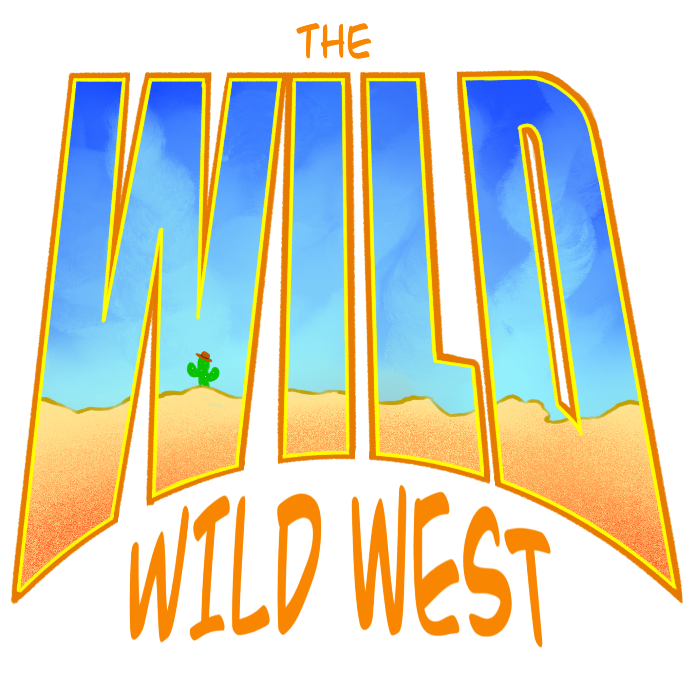
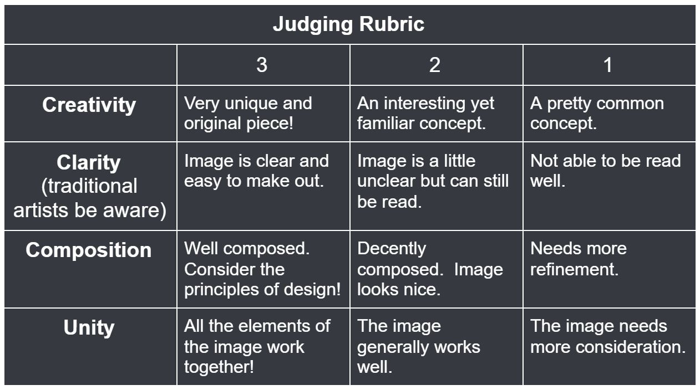

<!DOCTYPE html>
<html lang="en">

<head>
    <meta charset="UTF-8">
    <meta http-equiv="X-UA-Compatible" content="IE=edge">
    <meta name="viewport" content="width=device-width, initial-scale=1.0">
    <title>Genoluv Art Competition Rules</title>
    <link rel="shortcut icon" type="image/jpg" href="/fav.png" />
    
</head>

<body>

    <!-- Wrapper -->
    

        

            
        

        

            
<i>Cowboys. Sand. Old towns. And stand offs.</i> Everyone’s familiar with the wild west. But what's
                wilder than
                the
                wild west? The <b>WILD wild west!</b> 
                Welcome to the first Genoluv Art Competition. For this competition, your prompt is to take the classic
                wild
                west and put your own creative spin on it! Essentially, make it even <i>wilder</i> than it already is,
                in any
                way
                you like!

            
Start: <b>Tuesday, June 1st, 2021</b> 
                Deadline: <b>Tuesday, June 22nd, 2021</b> 
                Winner’s announced: <b>Wednesday, June 30th, 2021</b>
  
        

        

            <h1>But Who Can Compete?</h1>
            
EVERYONE!! (except Helpers, Moderators, and the Owners)

        

        

            <h1>How do I Enter?</h1>
            
Entry is simple! You’ll be given three weeks (count ‘em, 3!) to create your own amazing
                illustration.  
                After that, privately message a Helper, Moderator, or Owner your finished piece and that’s that!
                  
                We will be offering a <i>Normal</i> and <i>Beginner</i> entry level. <i>Beginner</i> is for
                <b>Beginners</b>, so it’s up to
                moderator discretion which entry level you’ll be entered at based upon what the moderators as a whole
                feel is appropriate.
            

        

        

            <h1>Are There any Restrictions or Requirements?</h1>
            
Yes! To be qualified to enter you must meet the following guidelines:

            <ol>
                <li><b>You must have a background!</b> You are given 3 weeks to work on this AND you have the potential
                    to win
                    real money! We expect some fully realized pieces of work!</li>
                <li><b>The minimum is shading!</b> We understand not everyone has access to good color materials, but we
                    do
                    expect some level of shading with discretion for personal style. Essentially, <b>NO LINE-ART
                        ONLY.</b></li>
                <li><b>Special Details!</b> Part of the fun of a competition is requiring something to see how artists
                    creatively think around it. For this competition, we want to see a <b>Cactus with a Cowboy Hat</b>
                    somewhere in the image. On a pin? On a hat? Carved in a tree? Or just part of the background? THE
                    MAIN CHARACTER??? It’s your choice, but make it happen! Be creative! Make it visible!</li>
                <li><b>No NSFW works!</b> We want to showcase this to the whole server, so we need it to be squeaky
                    clean. Keep
                    it PG-13 at MAX.</li>
            </ol>
        

        

            <h1>Cool, but what’s in it for me?</h1>
            
<b>
                    <i>PRIZES!!</i>
                </b> Now considering this is the first ever competition, we don’t have an insanely large prize pool
                to offer but we hope what we do offer is enough to pique your interests!
            

        

        

        

            <h1>How Will These be Judged?</h1>
            
<i>With the power of democracy (Sorta)!</i> The Moderators will judge all the submitted pieces until we
                have our finalists. Then the rest of server has the opputunity to vote on who wins the final prize!
                There can only be one vote
                per person.   We will also be providing this rubric to help guide voters (and mods) to making
                an
                intelligent
                judgement.

        

        

        

            <h1>Any Other Rules I Should Know About?</h1>
            
Yes, actually, and please follow them carefully!

            <ol>
                <li><b>Submit by the deadline.</b> Sounds easy enough, doesn’t it? No late work will be accepted.</li>
                <li><b>Do not post your submissions on the server.</b> We want to avoid people potentially stealing
                    ideas or
                    being discouraged by other people’s works! The mods will showcase them all at the end in a special
                    channel!</li>
                <li><b>No collaboration!</b> This needs to be fair. One-on-One! Winner takes all! Battle-Royale style!
                    Collaborators will be disqualified and banned from the next competition.</li>
                <li><b>The last winner can’t win again!</b> We don’t want chain-winners. So winners from the previous
                    competition can not win again. Feel free to enter though!</li>
                <li><b>Follow all the rules and requirements!</b> Sounds easy, dunnit?</li>
            </ol>
            
That’s everything guys! We hope to see your future works! :) 
                Please note that any rules are subject to change in the future.
            

            <a href="https://discord.com/invite/D9xyUec">
                
Join Genoluv Art on Discord!

            </a>
        

    

</body>

</html>